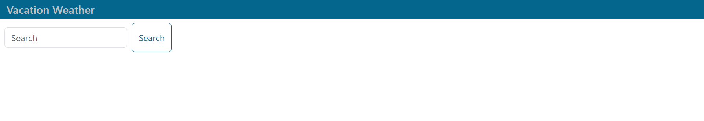

# <Vacation-Weather-App>

## Description

This is a webpage that allows fot the user to type in a "City" or "City, State" into the search bar to display the cities weather forecast for the current day and five day into the future. This will help the user create plans around the weather for their vacation location for up to five days.

## Table of Contents (Optional)

N/A

## Installation

To use this app the user must go to this url: https://cecrouch01.github.io/Vacaction-Weather-App

## Usage

To use this app type a city into the search bar and then hit enter. A 5 day weather forecast will be displayed. The data from that forecast will be saved and can be redisplayed by clicking on its newly made button. 

.png)
.png)

## Credits

Thanks to Joem Casusi for helping me learn how to organize my code and clean up some of the functions that I made.

## License

MIT License

Copyright (c) 2023 Caleb Crouch

Permission is hereby granted, free of charge, to any person obtaining a copy of this software and associated documentation files (the "Software"), to deal in the Software without restriction, including without limitation the rights to use, copy, modify, merge, publish, distribute, sublicense, and/or sell copies of the Software, and to permit persons to whom the Software is furnished to do so, subject to the following conditions:

The above copyright notice and this permission notice shall be included in all copies or substantial portions of the Software.

THE SOFTWARE IS PROVIDED "AS IS", WITHOUT WARRANTY OF ANY KIND, EXPRESS OR IMPLIED, INCLUDING BUT NOT LIMITED TO THE WARRANTIES OF MERCHANTABILITY, FITNESS FOR A PARTICULAR PURPOSE AND NONINFRINGEMENT. IN NO EVENT SHALL THE AUTHORS OR COPYRIGHT HOLDERS BE LIABLE FOR ANY CLAIM, DAMAGES OR OTHER LIABILITY, WHETHER IN AN ACTION OF CONTRACT, TORT OR OTHERWISE, ARISING FROM, OUT OF OR IN CONNECTION WITH THE SOFTWARE OR THE USE OR OTHER DEALINGS IN THE SOFTWARE.
